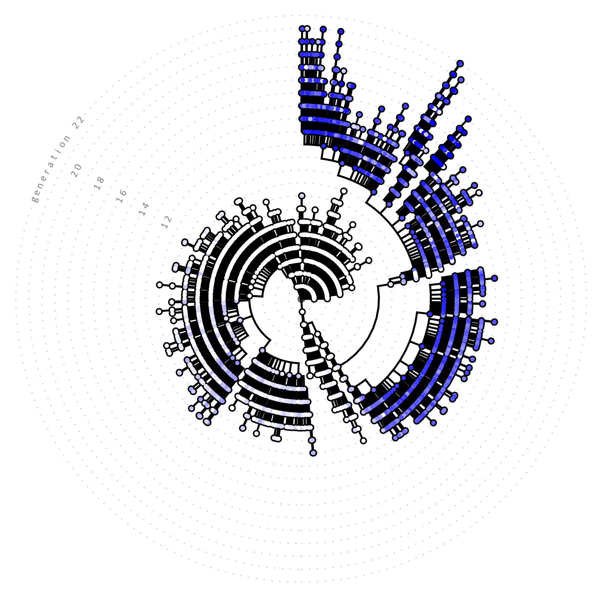

# AI.zymes
## A modular pipeline for enzyme design
 

### AI.zymes is in active development.
### Contributions, feedback, and collaborations are welcome!
### We are happy to assist you with geting AI.zymes to run on your systems.
### For questions, please reach out to: **Adrian.Bunzel@mpi-marburg.mpg.de**

Lucas P. Merlicek, Jannik Neumann, Abbie Lear, Vivian Degiorgi, Moor de Waal, Tudor-Stefan Cotet, Adrian J. Mulholland, H. Adrian Bunzel, **Angewandte Chemie International Edition** 2025, https://doi.org/10.1002/anie.202507031 *(accepted)*